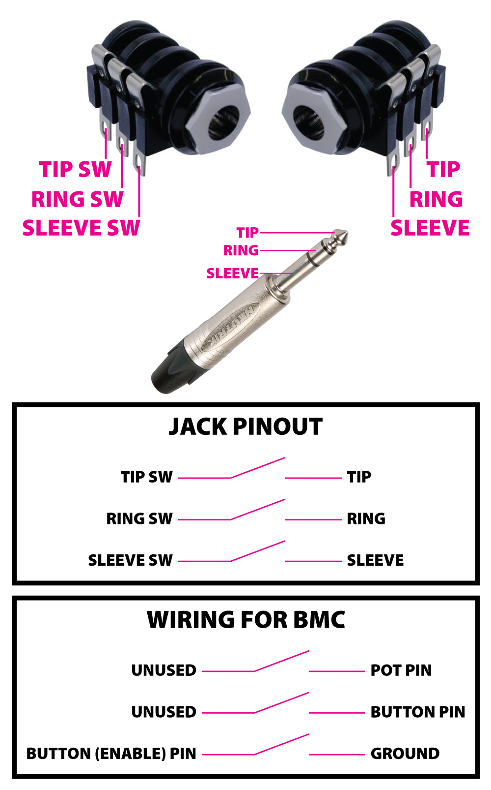

*Under MIT license.*

[Official BMC Website >> RoxXxtar.com/bmc](https://www.roxxxtar.com/bmc)

[< Back to Documentation](README.md)

# Aux Jacks
Have you ever used a MIDI controller with a 1/4" TRS jack where you can plug an expression pedal? they usually let you also use an external dual footswitch and you can change weather that input will read an Expression Pedal or dual buttons.

BMC has that too! BMC lets you use 2 buttons and a pot and convert them into and Aux Jack!

In order to use the Aux Jacks you have to use a switching 1/4" Jack like the one below and wire it as shown. Setting up An Aux Jack doesn't change the EEPROM structure, instead it uses the already compiled buttons and pot with their respective pins.

When the Aux Jack is set to Expression the button's pin becomes an output sending 3v to the pot, while the pot act's as a standard POT, when on Dual Button Mode, the POT's pin acts as Button pin.

In either mode the Enable Pin acts as a switch that tells BMC that something was plugged in or unplugged, this way when the Aux Jack is set as Expression and there's no Pot Connected, the Pot readings are ignored as the pin would be floating and a bunch of random data would be read.

***Aux Jacks can not use buttons or pots connected thru Muxes.***



### API
There are many API callbacks and functions available for use, these may not reflect the latest version

##### FUNCTIONS
```c++
```

##### CALLBACKS
```c++
// triggered when an aux jack detects a plug connected or disconnected
// @n the Aux Jack Index that had a state change.
// @state true if a connection has been made, false if disconnected.
void onAuxJackConnection(void (*fptr)(uint8_t n, bool state))
```
